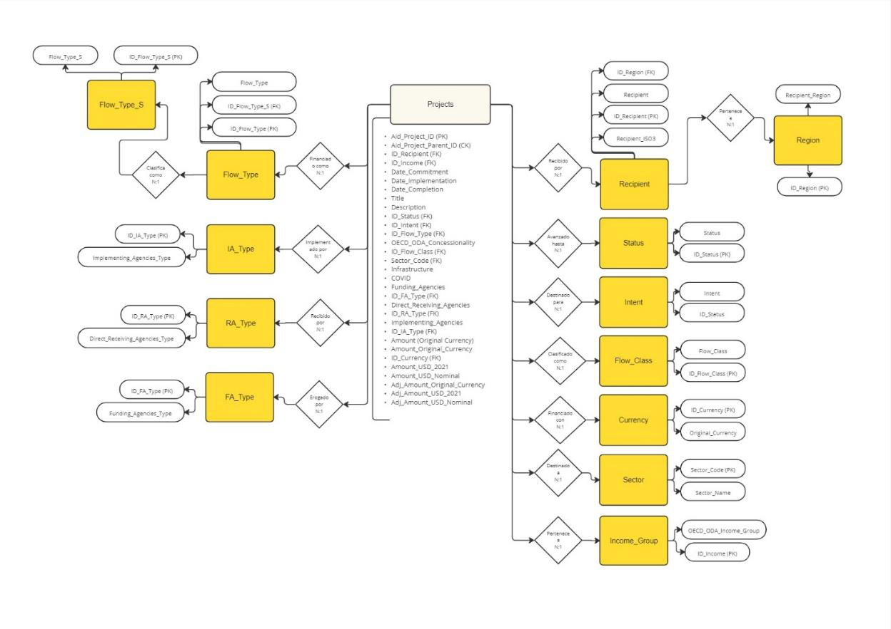
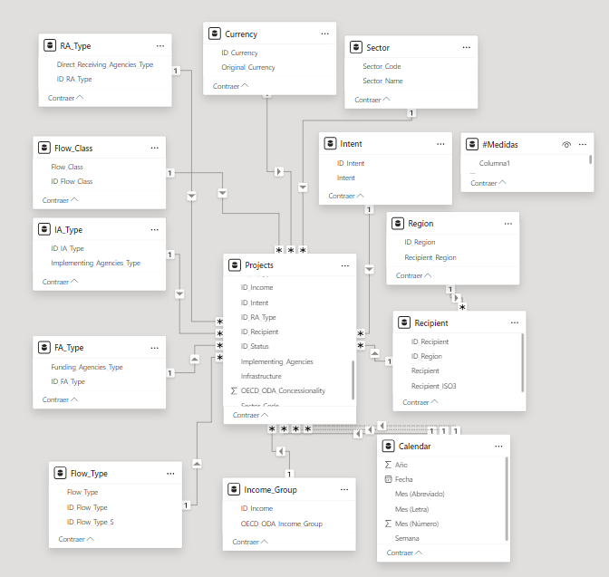
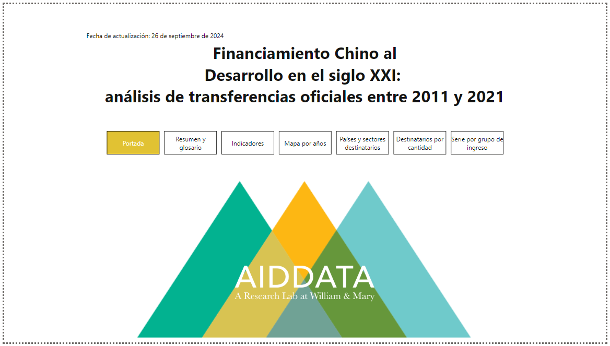
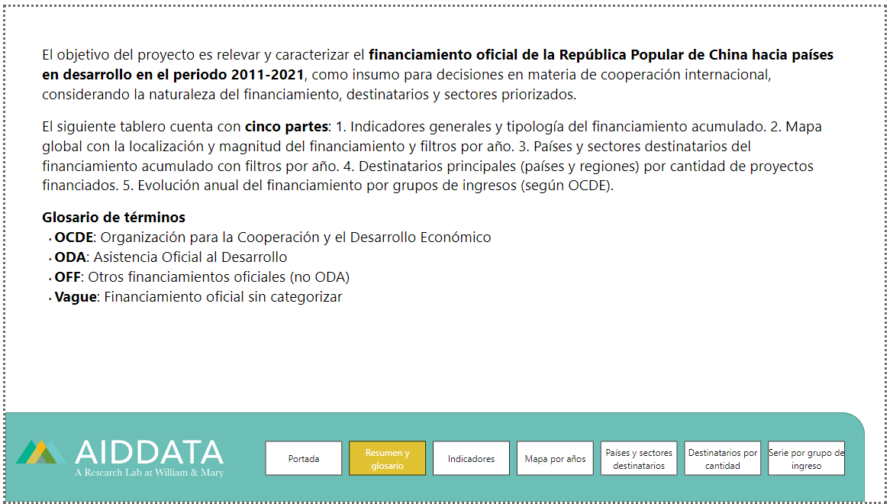
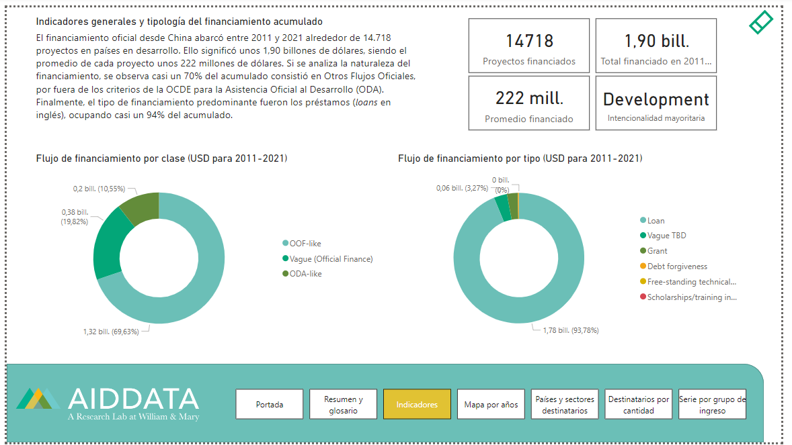
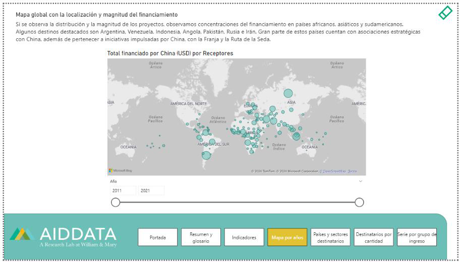
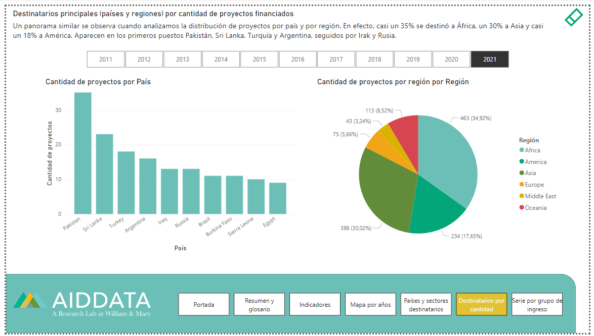
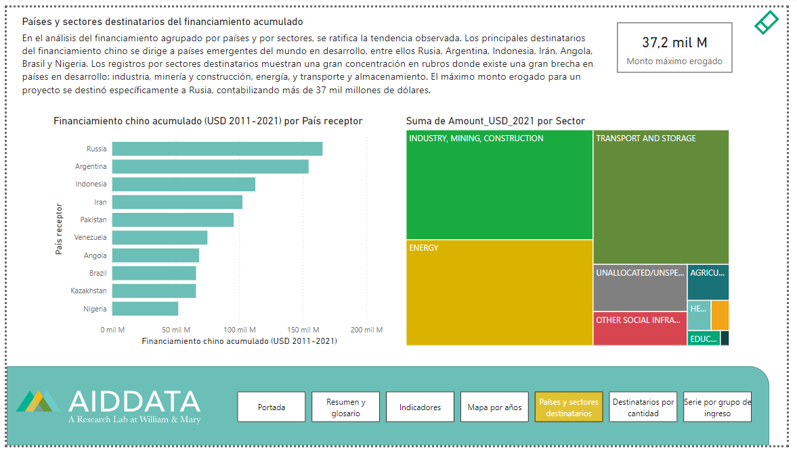
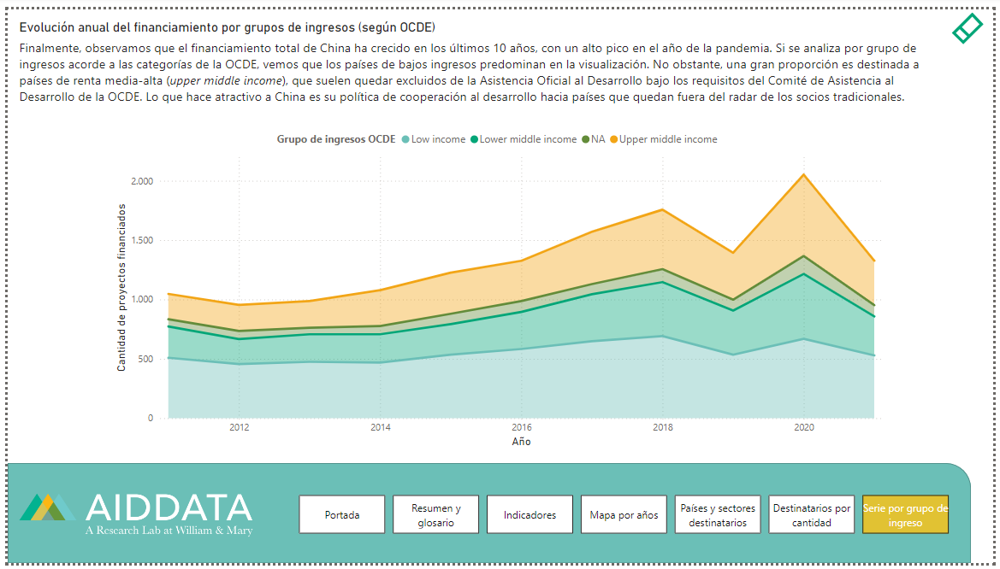

------------------------------------------------------------------------

**I. INTRODUCCIÓN**

**1. Descripción temática**

El trabajo propone realizar un análisis y visualización de datos sobre
financiamiento oficial de la República Popular de China hacia países en
desarrollo en el siglo XXI, especialmente su evolución en el tiempo y su
clasificación por destinatarios, sectores y tipo de transferencias.

**2. Objetivo del Proyecto**

El objetivo del proyecto es relevar y caracterizar el financiamiento
chino al desarrollo en el siglo XXI como insumo para decisiones en
materia de cooperación internacional, considerando la naturaleza del
financiamiento, destinatarios, agencias involucradas y sectores
priorizados.

**3. Hipótesis de análisis**

Se estima que las transferencias oficiales desde China se han
incrementado en más de un 100% en la última década. Gran parte de este
financiamiento ha sido instrumentado por agencias de carácter político.
A su vez, se presupone una concentración mayoritaria del financiamiento
hacia países asiáticos y africanos, especialmente en sectores de
infraestructura. Finalmente, se estima que al menos dos tercios del
financiamiento chino hacia estos países se catalogan como "Otros Flujos
Oficiales", ya que no adhieren a los criterios de la OCDE de "asistencia
al desarrollo".

**4. Usuario Final**

Los datos obtenidos serán utilizados para actividades de consultoría
orientada al ámbito de la cooperación internacional, siendo un insumo
para funcionarios públicos de los niveles nacional, provincial o
municipal interesados en estas tendencias globales.

**5. Nivel de Aplicación / Alcance**

La propuesta está orientada a mandos medios gubernamentales a cargo del
análisis de las principales tendencias del financiamiento chino global y
de la formulación de nuevos proyectos de cooperación internacional. Está
pensada para ser utilizada a un **nivel de aplicación táctico.**

**6. Herramientas tecnológicas implementadas**

Para la creación y transformación de la base de datos, se empleó
**Microsoft Excel**. Para transformaciones adicionales, configuración de
relaciones, diseño de tablero y análisis de los datos, se recurrió a
**Power BI**.

**7. Tabla de versionado**

+-----------------------------------+-----------------------------------+
| > **Versión**                     | > **Acciones**                    |
+===================================+===================================+
| > V00                             | > Selección y estructuración del  |
|                                   | > dataset\                        |
|                                   | > Definición del proyecto a       |
|                                   | > realizar\                       |
|                                   | > Generación de hipótesis acerca  |
|                                   | > del análisis\                   |
|                                   | > Transformación inicial y        |
|                                   | > normalización de la base        |
+-----------------------------------+-----------------------------------+
| > V01                             | > Desarrollo de marca y paleta de |
|                                   | > colores\                        |
|                                   | > Diseño de los primeros Mockup\  |
|                                   | > Creación de la primera página   |
|                                   | > del tablero\                    |
|                                   | > Definición del objetivo del     |
|                                   | > proyecto, alcance, usuario      |
|                                   | > final y nivel de aplicación.    |
|                                   | > Elaboración del diagrama de     |
|                                   | > entidad-relación y del listado  |
|                                   | > de tablas con claves.           |
+-----------------------------------+-----------------------------------+
| > V02                             | > Elaboración del bosquejo        |
|                                   | > inicial del tablero Carga de la |
|                                   | > base de datos al software.      |
|                                   | >                                 |
|                                   | > Generación del modelo           |
|                                   | > relacional\                     |
|                                   | > Elaboración de tablas de        |
|                                   | > medidas y calendarios.          |
|                                   | >                                 |
|                                   | > Estructura inicial de la        |
|                                   | > documentación                   |
+-----------------------------------+-----------------------------------+
| > V03                             | > Elaboración de análisis,        |
|                                   | > indicadores y visualización de  |
|                                   | > los datos principales           |
|                                   | > Desarrollo de marca y paleta de |
|                                   | > colores\                        |
|                                   | > Elaboración del tablero con     |
|                                   | > portada, navegación y solapas\  |
|                                   | > Elaboración de la documentación |
|                                   | > con índice, manual de usuario y |
|                                   | > análisis.                       |
+-----------------------------------+-----------------------------------+

**II. BASE DE DATOS, TABLAS Y DIAGRAMAS**

**1. Base de datos**

Se obtuvo una muestra de la base de datos (2023), un laboratorio de
investigación sobre desarrollo internacional con base en el *William &
Mary's Global Research Institute*. Los registros recogen 20.985
proyectos en 165 países de renta baja y media apoyados con
transferencias financieras y en especie de instituciones oficiales de
China por un valor de 1.34 billones de dólares. Aunque la base
originaria incluye datos del 2000 al 2024, la muestra sólo incluye
compromisos entre 2010 y 2021. Consta de 126 campos de carácter
cualitativo y cuantitativo, entre los que se incluyen un ID de registro
para cada proyecto/actividad (AidData Record ID) y para aquellos bajo un
proyecto padre (AidData Parent ID), países receptores, región de
pertenencia y calificación según nivel de desarrollo, fechas de
compromiso, inicio y finalización de los proyectos, títulos y
descripciones, estatus, propósito primario, tipo de transferencia,
umbral de concesionalidad, clase de flujo, sector destinatario, agencias
financiadoras, receptoras y ejecutoras, montos en divisa original y en
dólares, etc.

**2. Tablas y características**

+-----------------------+-----------------------+-----------------------+
| Projects              |                       |                       |
+=======================+=======================+=======================+
| > Registro de         |                       |                       |
| > proyectos de        |                       |                       |
| > cooperación al      |                       |                       |
| > desarrollo y        |                       |                       |
| > transferencias      |                       |                       |
| > financieras o en    |                       |                       |
| > especie desde China |                       |                       |
| > (2011-2021)         |                       |                       |
+-----------------------+-----------------------+-----------------------+
| Columns               | Data Type             | Key                   |
+-----------------------+-----------------------+-----------------------+
| Aid_Project_ID        | VARCHAR               | PK                    |
+-----------------------+-----------------------+-----------------------+
| Aid_Project_Parent_ID | VARCHAR               | CK                    |
+-----------------------+-----------------------+-----------------------+
| ID_Recipient          | VARCHAR               | FK                    |
+-----------------------+-----------------------+-----------------------+
| ID_Income             | VARCHAR               | FK                    |
+-----------------------+-----------------------+-----------------------+
| Date_Commitment       | DATE                  |                       |
+-----------------------+-----------------------+-----------------------+
| Date_Implementation   | DATE                  |                       |
+-----------------------+-----------------------+-----------------------+
| Date_Completion       | DATE                  |                       |
+-----------------------+-----------------------+-----------------------+
| Title                 | VARCHAR               |                       |
+-----------------------+-----------------------+-----------------------+
| Description           | VARCHAR               |                       |
+-----------------------+-----------------------+-----------------------+
| ID_Status             | VARCHAR               | FK                    |
+-----------------------+-----------------------+-----------------------+
| ID_Intent             | VARCHAR               | FK                    |
+-----------------------+-----------------------+-----------------------+
| ID_Flow_Type          | VARCHAR               | FK                    |
+-----------------------+-----------------------+-----------------------+
| OEC                   | FLOAT                 |                       |
| D_ODA_Concessionality |                       |                       |
+-----------------------+-----------------------+-----------------------+
| ID_Flow_Class         | VARCHAR               | FK                    |
+-----------------------+-----------------------+-----------------------+
| Sector_Code           | VARCHAR               | FK                    |
+-----------------------+-----------------------+-----------------------+
| Infrastructure        | VARCHAR               |                       |
+-----------------------+-----------------------+-----------------------+
| COVID                 | VARCHAR               |                       |
+-----------------------+-----------------------+-----------------------+
| Funding_Agencies      | VARCHAR               |                       |
+-----------------------+-----------------------+-----------------------+
| ID_FA_Type            | VARCHAR               | FK                    |
+-----------------------+-----------------------+-----------------------+
| Dire                  | VARCHAR               |                       |
| ct_Receiving_Agencies |                       |                       |
+-----------------------+-----------------------+-----------------------+
| ID_RA_Type            | VARCHAR               | FK                    |
+-----------------------+-----------------------+-----------------------+
| Implementing_Agencies | VARCHAR               |                       |
+-----------------------+-----------------------+-----------------------+
| ID_IA_Type            | VARCHAR               | FK                    |
+-----------------------+-----------------------+-----------------------+
| Amo                   | FLOAT                 |                       |
| unt_Original_Currency |                       |                       |
+-----------------------+-----------------------+-----------------------+
| ID_Currency           | VARCHAR               | FK                    |
+-----------------------+-----------------------+-----------------------+
| Amount_USD_2021       | FLOAT                 |                       |
+-----------------------+-----------------------+-----------------------+
| Amount_USD_Nominal    | FLOAT                 |                       |
+-----------------------+-----------------------+-----------------------+
| Adj_Amo               | FLOAT                 |                       |
| unt_Original_Currency |                       |                       |
+-----------------------+-----------------------+-----------------------+
| Adj_Amount_USD_2021   | FLOAT                 |                       |
+-----------------------+-----------------------+-----------------------+
| A                     | FLOAT                 |                       |
| dj_Amount_USD_Nominal |                       |                       |
+-----------------------+-----------------------+-----------------------+

  -----------------------------------------------------------------------
  Recipient                                       
  ----------------------- ----------------------- -----------------------
  Listado de receptores                           
  (países y otros) de                             
  financiamiento chino y                          
  pertenencia regional.                           

  Columns                                         Key

  Recipient               VARCHAR                 

  ID_Recipient            VARCHAR                 PK
  -----------------------------------------------------------------------
  

  -----------------------------------------------------------------------
  Recipient_ISO3          VARCHAR                 
  ----------------------- ----------------------- -----------------------
  ID_Region               VARCHAR                 FK

  -----------------------------------------------------------------------

  -----------------------------------------------------------------------
  Region                                          
  ----------------------- ----------------------- -----------------------
  Listado de regiones                             
  geográficas al que                              
  pertenecen los                                  
  receptores del                                  
  proyecto/actividad                              

  Columns                 Data Type               Key

  Recipient_Region        VARCHAR                 

  ID_Region               VARCHAR                 PK
  -----------------------------------------------------------------------

+-------------+-------------+-------------+-------------+-------------+
|             |             |             |             |             |
|Income_Group |             |             |             |             |
+=============+=============+=============+=============+=============+
| > Clasificación de países según su nivel de ingresobajo criterio de |
| > la OCDE para Asistencia Oficial al Desarrollo (ODA).              |
+-------------+-------------+-------------+-------------+-------------+
| Columns     |             | Data Type   |             | Key         |
+-------------+-------------+-------------+-------------+-------------+
| OECD_ODA_I  |             | VARCHAR     |             |             |
| ncome_Group |             |             |             |             |
+-------------+-------------+-------------+-------------+-------------+
| ID_Income   |             | VARCHAR     |             | PK          |
+-------------+-------------+-------------+-------------+-------------+
| Status      |             |             |             |             |
+-------------+-------------+-------------+-------------+-------------+
| > Estado de |             |             |             |             |
| > avance de |             |             |             |             |
| > proyectos |             |             |             |             |
| >           |             |             |             |             |
| financiados |             |             |             |             |
| > por China |             |             |             |             |
| > (c        |             |             |             |             |
| ompletados, |             |             |             |             |
| > imp       |             |             |             |             |
| lementados, |             |             |             |             |
| >           |             |             |             |             |
| cancelados, |             |             |             |             |
| > s         |             |             |             |             |
| uspendidos, |             |             |             |             |
| > otros)    |             |             |             |             |
+-------------+-------------+-------------+-------------+-------------+
| Columns     | Data Type   |             | Key         |             |
+-------------+-------------+-------------+-------------+-------------+
| Status      | VARCHAR     |             |             |             |
+-------------+-------------+-------------+-------------+-------------+
| ID_Status   | VARCHAR     |             | PK          |             |
+-------------+-------------+-------------+-------------+-------------+

  -----------------------------------------------------------------------
  Intent                                          
  ----------------------- ----------------------- -----------------------
  Propósito primario del                          
  proyecto financiada por                         
  China (desarrollo,                              
  comercial, militar,                             
  representacional o                              
  mixta)                                          

  Columns                 Data Type               Key

  Intent                  VARCHAR                 

  ID_Intent               VARCHAR                 PK
  -----------------------------------------------------------------------

+-----------------------+-----------------------+-----------------------+
| Flow_Type             |                       |                       |
+=======================+=======================+=======================+
| > Tipo simplificado   |                       |                       |
| > de transferencia    |                       |                       |
| > financiera o en     |                       |                       |
| > especie (préstamo,  |                       |                       |
| > condonación de      |                       |                       |
| > deuda, subvención y |                       |                       |
| > vago por            |                       |                       |
| > determinar)         |                       |                       |
+-----------------------+-----------------------+-----------------------+
| Columns               | Data Type             | Key                   |
+-----------------------+-----------------------+-----------------------+
| Flow_Type             | VARCHAR               |                       |
+-----------------------+-----------------------+-----------------------+
| ID_Flow_Type          | VARCHAR               | PK                    |
+-----------------------+-----------------------+-----------------------+
| ID_Flow_Type_S        | VARCHAR               | FK                    |
+-----------------------+-----------------------+-----------------------+

+-----------------------+-----------------------+-----------------------+
| Flow_Type_S           |                       |                       |
+=======================+=======================+=======================+
| > Tipo de             |                       |                       |
| > transferencia       |                       |                       |
| > financiera o en     |                       |                       |
| > especie (préstamo,  |                       |                       |
| > condonación de      |                       |                       |
| > deuda,              |                       |                       |
| > reescalonamiento de |                       |                       |
| > deuda, subvención,  |                       |                       |
| > becas/formación en  |                       |                       |
| > país donante,       |                       |                       |
| > asistencia técnica  |                       |                       |
| > independiente y     |                       |                       |
| > vago por            |                       |                       |
| > determinar)         |                       |                       |
+-----------------------+-----------------------+-----------------------+
| Columns               | Data Type             | Key                   |
+-----------------------+-----------------------+-----------------------+
| Flow_Type_S           | VARCHAR               |                       |
+-----------------------+-----------------------+-----------------------+
| ID_Flow_Type_S        | VARCHAR               | PK                    |
+-----------------------+-----------------------+-----------------------+

+-----------------------+-----------------------+-----------------------+
| Flow_Class            |                       |                       |
+=======================+=======================+=======================+
| > Clasificación de la |                       |                       |
| > asistencia prevista |                       |                       |
| > en proyectos, en    |                       |                       |
| > base a metodología  |                       |                       |
| > CAD-OCDE para medir |                       |                       |
| > Ayuda Oficial al    |                       |                       |
| > Desarrollo y Otros  |                       |                       |
| > Flujos Oficiales.   |                       |                       |
+-----------------------+-----------------------+-----------------------+
| Columns               | Data Type             | Key                   |
+-----------------------+-----------------------+-----------------------+
| Flow_Class            | VARCHAR               |                       |
+-----------------------+-----------------------+-----------------------+
| ID_Flow_Class         | VARCHAR               | PK                    |
+-----------------------+-----------------------+-----------------------+

+-----------------------+-----------------------+-----------------------+
| Sector                |                       |                       |
+=======================+=======================+=======================+
| > Nombre de sector    |                       |                       |
| > primario al que se  |                       |                       |
| > destina el          |                       |                       |
| > proyecto, en base   |                       |                       |
| > al esquema de       |                       |                       |
| > categorización      |                       |                       |
| > sectorial la OCDE.  |                       |                       |
+-----------------------+-----------------------+-----------------------+
| Columns               | Data Type             | Key                   |
+-----------------------+-----------------------+-----------------------+

  -----------------------------------------------------------------------
  Sector_Code             VARCHAR                 PK
  ----------------------- ----------------------- -----------------------
  Sector_Name             VARCHAR                 

  -----------------------------------------------------------------------

  -----------------------------------------------------------------------
  Currency                                        
  ----------------------- ----------------------- -----------------------
  Tipo de divisa nacional                         
  en el que se financia                           
  el proyecto/actividad.                          

  Columns                 Data Type               Key

  ID_Currency             VARCHAR                 PK

  Original_Currency       VARCHAR                 
  -----------------------------------------------------------------------

  -----------------------------------------------------------------------
  FA_Type                                         
  ----------------------- ----------------------- -----------------------
  Clasificación de                                
  agencias de                                     
  financiación de                                 
  proyectos/actividades                           

  Columns                 Data Type               Key

  Funding_Agencies_Type   VARCHAR                 

  ID_FA_Type              VARCHAR                 PK
  -----------------------------------------------------------------------

  --------------------------------------------------------------------------------
  RA_Type                                                  
  -------------------------------- ----------------------- -----------------------
  Clasificación de agencias                                
  receptoras de financiación para                          
  proyectos/actividades.                                   

  Columns                          Data Type               Key

  Direct_Receiving_Agencies_Type   VARCHAR                 

  ID_RA_Type                       VARCHAR                 PK
  --------------------------------------------------------------------------------

  ----------------------------------------------------------------------------
  IA_Type                                              
  ---------------------------- ----------------------- -----------------------
  Clasificación de agencias                            
  implementadoras de para                              
  proyectos/actividades                                
  financiadas.                                         

  Columns                      Data Type               Key

  Implementing_Agencies_Type   VARCHAR                 

  ID_IA_Type                   VARCHAR                 PK
  ----------------------------------------------------------------------------

**3. Diagrama Entidad Relación**

{width="5.643054461942257in"
height="3.995832239720035in"}

Se muestra un esquema con el DER del proyecto final. El diagrama
contempla las tablas definidas previamente, sus relaciones y los campos
con el tipo de dato y las claves correspondientes (Primary key, Foreign
key y Candidate Key). El esquema gira en torno a una tabla principal
("Projects"), con la cual se conectan las restantes tablas con
relaciones uno a muchos (1:N).

**III. DOCUMENTACIÓN**

**1. Flujo y transformaciones de datos**

En primera instancia, se procedió a conectar Power BI Desktop con la
base de datos de Excel que será la fuente para el proyecto final:
China_GDF (Global Development Finance).

En segundo lugar, se generó el modelo relacional y se revisaron las
relaciones entre las tablas. Comprobamos que no es necesario generar una
tabla puente, ya que todos los datos cuentan con relación uno a muchos
(1:N).

En tercera instancia, se generaron las transformaciones sobre los campos
que lo requieran:

• Eliminar las filas vacías de las tablas.

• Eliminamos la primera fila superior.

• Eliminar la primera fila como encabezado\
• Transformar los tipos de campos, principalmente campos ID (claves) a
VARCHAR (texto). • Modificar los nombres de las columnas para
manipularlas con mayor facilidad.

**2. Modelo relacional**

En Power BI, nos ocupamos de la construcción del Modelo Relacional,
verificando las relaciones pertinentes entre las claves de las tablas
cargadas cuando fue necesario. Como se puede observar, las el modelo se
estructura en torno a la tabla "Projects", a partir de la cual se
generaron las restantes tablas. A continuación, se presenta el modelo
armado en el programa:

{width="4.504166666666666in"
height="4.272222222222222in"}

**3. Nuevas tablas y medidas:**

El proyecto también contempla la creación de las siguientes tablas
complementarias: una tabla calendario fija y una tabla de medidas
calculadas para la generación de indicadores.

**a. Tabla Calendario Fija**

Se tituló "Calendario" e incluye las columnas Fecha, Año, Mes (Número),
Mes (Letra) y Semana. A continuación, se procedió a incluir al
Calendario en el modelo relacional, trazando las relaciones
correspondientes con la tabla "Projects" y activando la relación con
"Date_Commitment". 

**b. Tabla Medidas**

Se tituló "#Medidas" y permite realizar cálculos sobre los datos de las
tablas e incorporar indicadores al tablero. Las medidas incluidas
fueron:

• **AVG_Monto**: Calcula un promedio de cada proyecto financiado por
China.

• **Cant_Proyectos**: Calcula la cantidad total de proyectos financiados
por China.

• **Monto_Total_USD**: Calcula la suma total de financiamiento en
dólares constantes de 2021.

• **Moda_Intent**: Es una medida calculada avanzada que obtiene la moda
de las intencionalidades de los proyectos.

• **Top_Proyecto**: Devuelve el proyecto de mayor financiamiento.

**4. Maqueta del Dashboard en Power BI:**

La maqueta del Dashboard incluye hasta ahora una **portada** con título
y navegador entre las páginas, una página con resumen y glosario del
proyecto, y cinco páginas con visualizaciones e indicadores. Los
gráficos incluyen evolución de proyectos en el tiempo, distribución
espacial del financiamiento, y principales sectores destinatarios. Los
indicadores reflejan las medidas calculadas en la tabla de medidas.

{width="5.543055555555555in" height="3.15in"}

{width="5.5875in" height="3.15in"}

{width="5.602777777777778in" height="3.1499989063867018in"}

{width="5.534722222222222in" height="3.15in"}

{width="5.558333333333334in" height="3.15in"}

{width="5.565277777777778in" height="3.1499989063867018in"}

{width="5.522222222222222in"
height="3.15in"}

**5. Breve descripción del análisis realizado**

El tablero cuenta con cinco partes: 1. Indicadores generales y tipología
del financiamiento acumulado. 2. Mapa global con la localización y
magnitud del financiamiento y filtros por año. 3. Países y sectores
destinatarios del financiamiento acumulado con filtros por año. 4.
Destinatarios principales (países y regiones) por cantidad de proyectos
financiados. 5. Evolución anual del financiamiento por grupos de
ingresos (según OCDE).

El financiamiento oficial desde China abarcó entre 2011 y 2021 alrededor
de 14.718 proyectos en países en desarrollo. Ello significó unos 1,90
billones de dólares, siendo el promedio de cada proyecto unos 222
millones de dólares. Si se analiza la naturaleza del financiamiento, se
observa casi un 70% del acumulado consistió en Otros Flujos Oficiales,
por fuera de los criterios de la OCDE para la Asistencia Oficial al
Desarrollo (ODA). Finalmente, el tipo de financiamiento predominante
fueron los préstamos (*loans* en inglés), ocupando casi un 94% del
acumulado.

Si se observa la distribución y la magnitud de los proyectos, observamos
concentraciones del financiamiento en países africanos, asiáticos y
sudamericanos. Algunos destinos destacados son Argentina, Venezuela,
Indonesia, Angola, Pakistán, Rusia e Irán. Gran parte de estos países
cuentan con asociaciones estratégicas con China, además de pertenecer a
iniciativas impulsadas por China, con la Franja y la Ruta de la Seda.

En el análisis del financiamiento agrupado por países y por sectores, se
ratifica la tendencia observada. Los principales destinatarios del
financiamiento chino fueron países emergentes del mundo en desarrollo,
entre ellos Rusia, Argentina, Indonesia, Irán, Angola, Brasil y Nigeria.
Los registros por sectores destinatarios muestran una gran concentración
en rubros donde existe una gran brecha en países en desarrollo:
industria, minería y construcción, energía, y transporte y
almacenamiento. El máximo monto erogado para un proyecto se destinó
específicamente a Rusia, contabilizando más de 37 mil millones de
dólares.

Un panorama similar se observa cuando analizamos la distribución de
proyectos por país y por región. En efecto, casi un 35% se destinó a
África, un 30% a Asia y casi un 18% a América. Aparecen en los primeros
puestos Pakistán, Sri Lanka, Turquía y Argentina, seguidos por Irak y
Rusia.

Finalmente, observamos que el financiamiento total de China ha crecido
en los últimos 10 años, con un alto pico en el año de la pandemia. Si se
analiza por grupo de ingresos acorde a las categorías de la OCDE, vemos
que los países de bajos ingresos predominan en la visualización. No
obstante, una gran proporción es destinada a países de renta media-alta
(*upper middle income*), que suelen quedar excluidos de la Asistencia
Oficial al Desarrollo bajo los requisitos del Comité de Asistencia al
Desarrollo de la OCDE. Lo que hace atractivo a China es su política de
cooperación al desarrollo hacia países que quedan fuera del radar de los
socios tradicionales.

**III. CONCLUSIONES Y LINEAS DE ACCIÓN**

A partir de lo expuesto, se concluye que el financiamiento al desarrollo
de China ha crecido considerablemente en la última década. Aunque no
llegó a duplicarse, sí alcanzó un pico cercano a esos registros durante
el año de la pandemia. Por otra parte, se observó que las transferencias
se han direccionado hacia países y sectores tradicionalmente excluidos
de la Asistencia Oficial al Desarrollo, independientemente de su nivel
de ingresos y pertenencia regional. Aunque los mayores destinatarios han
sido países de bajos ingresos según los criterios de la OCDE, con
especial foco en África, los mayores receptores de transferencias chinas
no forman parte de estos grupos. Asimismo, los sectores de
infraestructura y energía se posicionan entre los más financiados por
este país, lo cual indica un abordaje hacia problemas estructurales en
estos países. Ello ratifica las hipótesis establecidas previamente, y
amplía su alcance hacia países de renta media-alta.

Argentina aparece entre los primeros lugares de los registros de
transferencias chinas, tanto en cantidad de proyectos como en monto
acumulado. Considerando la intención inicial de elaborar un análisis
táctico que permita reforzar la estrategia de América Latina y de
Argentina en la búsqueda de financiamiento, se proponen las siguientes
líneas de acción:

1. Realizar un mapeo exhaustivo acerca de las actividades apoyadas por
China en América Latina, con foco en Argentina, que contemple
información cualitativa adicional para un mejor perfil de las
actividades chinas en el país.

2. Elaborar un informe adicional acerca de los proyectos financiados en
Argentina en particular y en América Latina en general, contemplando los
rasgos comunes del financiamiento y los criterios para su asignación.

3. Comparar las características del financiamiento oficial de China con
los criterios empleados por agencias de países tradicionales y del
propio Comité de Asistencia al Desarrollo de la OCDE.

4. Realizar relevamientos adicionales acerca de las agencias
financiadoras de China, sus convocatorias y sus lineamientos para la
elaboración y presentación de proyectos gubernamentales.

5. Coordinar entrevistas con informantes claves involucrados en
financiamientos en la región, especialmente en Argentina, a partir de
mañana
